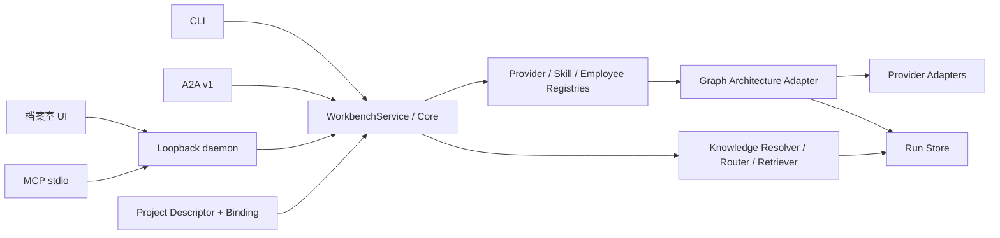

# Local Agent Workbench

这是从 `cart-fe-workflow-review` 的多 Agent 方案中独立抽象出的本地优先员工与架构工作台。源项目没有被修改；本仓库将 Provider、共享 Skill、Role identity、Employee、Architecture、Workflow、Session、Run Store 与协议入口拆成独立边界。

第一版已经可以：

- 创建、修订、复制和归档本地 Employee；
- 灵活定义背景、职责、目标、约束、提示词、Skill、Provider、权限与输出 Schema；
- 在独立 Skill 台账中注册、查看、版本化修订、归档与恢复能力，并对每个员工单独绑定、配置或停用；
- 在每份员工档案中核对 Provider 模型、adapter 与脱敏后的启动指令；
- 独立维护带 Collection、Source、Revision 和发布指针的知识库，并用可复用 Knowledge Profile 给员工和项目角色按需分配；
- 在知识后台通过项目内部 Codex 员工进行受限对话；LLM 只经 Knowledge Control MCP 读取、试跑和生成待人工审批的变更单；
- 在 Employee 档案中通过项目内配置管家对话起草严格语义 Proposal，再由人逐项审阅并显式生成新版本；高级表单保留为精确查看与微调入口；
- 从 CLI、HTTP、MCP 或本地 UI 直接调用任意 Employee；
- 用一份短小的项目声明接入代码仓库，在项目角色槽位上选择 Employee 与 Skill 子集，而不复制完整 Prompt；
- 查看版本固定的 Session、上下文、Knowledge Plan、完整有效 Prompt，以及按字段编译的有效执行配置与来源快照；
- 从四种常用多 Agent 模板生成 Graph 草稿，在画布拖动节点、改派员工与编辑依赖，并保存不可变 Run 证据；
- 将一个 Employee 或 Workflow 发布成 A2A v1 Agent；
- 在 `127.0.0.1` 上运行由 `claude-kimi` 设计的「档案室 / Dossier Office」客户端。

## 形态

| 层 | 责任 | v1 状态 |
| --- | --- | --- |
| TypeScript Core | 校验、编译、执行、版本与证据 | 已完成 |
| Knowledge runtime | Resolver、Router、Retriever、Revision 与引用证据 | 已完成，本地词项索引 |
| CLI | 人工与 CI 的确定性入口 | 已完成 |
| Codex Skill | 多 Agent 架构设计指导 | 已完成，保持薄层 |
| Local daemon | 单写者、共享注册表与本地 API | 已完成，默认仅回环地址 |
| React client | Employee、Project、Skill、Workflow、Run、Publication 工作台 | 已完成 |
| MCP | 调用 Employee/Workflow，或以受限 profile 代理知识控制面 | 已完成，stdio 代理 daemon |
| A2A | 将 Employee/Workflow 作为统一 Agent 发布 | 已完成，JSON-RPC v1 |

MCP 和 A2A 都是协议适配边界，不是多 Agent Workflow 模型。直接调用 Employee 也不会绕开架构层，而是编译成一个节点的 Graph。



## 快速开始

```bash
npm install
npm run check
npm run workbench
```

然后打开 [http://127.0.0.1:4318](http://127.0.0.1:4318)。默认数据目录是 `~/.multi-agent/workbench`，可用 `MULTI_AGENT_DATA_DIR` 或 `--data-root` 覆盖。默认 `mock` Provider 不需要账号，可以先完成全链路验收。

开发客户端：

```bash
npm run workbench
npm run dev:client
```

Vite 开发页位于 `http://127.0.0.1:4319`，API 转发到 4318。

## CLI

声明式 Workflow CLI 继续可用：

```bash
npm run cli -- validate --config templates/review-council/multi-agent.yaml
npm run cli -- plan review-council --config templates/review-council/multi-agent.yaml --format mermaid
npm run cli -- run review-council --config templates/review-council/multi-agent.yaml --input templates/review-council/input.example.json
```

Workbench CLI 使用同一份全局注册表：

```bash
npm run cli -- workbench skill-create templates/workbench/skill.example.json
npm run cli -- workbench employee create templates/workbench/employee.example.json
npm run cli -- workbench employee list
npm run cli -- workbench employee invoke local-researcher "核对这份技术方案"
npm run cli -- workbench employee context local-researcher
npm run cli -- workbench knowledge-base create templates/workbench/knowledge/local-agent-workbench.knowledge-base.json
npm run cli -- workbench knowledge-base sync local-agent-workbench
npm run cli -- workbench knowledge-base publish local-agent-workbench
npm run cli -- workbench knowledge-profile create templates/workbench/knowledge/product.knowledge-profile.json
npm run cli -- workbench employee knowledge local-researcher workbench-product-knowledge
npm run cli -- workbench project connect /path/to/project
npm run cli -- workbench project bind your-project project-binding.json
npm run cli -- workbench project invoke your-project tester "验收当前改动"
npm run cli -- workbench employee create templates/workbench/mihuhu-frontend-engineer.employee.json
npm run cli -- workbench project connect .
npm run cli -- workbench project bind local-agent-workbench templates/workbench/local-agent-workbench.binding.json
npm run cli -- workbench workflow create templates/workbench/workflow.example.json
npm run cli -- workbench workflow run research-review --input templates/workbench/input.example.json
npm run cli -- workbench entrance-policy create templates/workbench/default-task-entrance-policy.json
```

员工修改生成新版本；已有 Session 保持固定版本。普通复制不会复制 Session、密钥和 Run 历史。删除语义是软归档，历史证据继续可读。

## MCP 与 A2A

先运行 daemon，再把 MCP 客户端命令配置为：

```json
{
  "command": "multi-agent-mcp",
  "args": ["--daemon-url", "http://127.0.0.1:4318"]
}
```

仓库内开发可使用 `npm run mcp -- --daemon-url http://127.0.0.1:4318`。MCP tools 包括员工、项目角色与 Workflow 调试入口，以及面向外部会话的 `list_publications`、`invoke_publication` 调用包入口。项目通过 `invoke_project_role` 解析任用关系；调用方不需要拼接员工 Prompt。

Publication 的 A2A 地址为：

```text
Agent Card: /a2a/<publication-id>/.well-known/agent-card.json
JSON-RPC:   /a2a/<publication-id>
```

v1 只监听回环地址且没有认证，不应直接暴露到局域网或公网。业务 `blocked` 映射为 completed Task + Block artifact；只有 Provider、解析、Schema 或运行时技术故障映射为 failed Task。

## 稳定边界

- `providers`：定义“怎么调用”；Adapter 代码注册与 Provider 实例注册彼此分开。
- `skills`：定义可复用能力、配置契约和声明工具；多个 Employee 可以用不同配置复用。
- `employees`：定义“谁负责”，是版本化、可寻址的运行实例，不在 `src/` 硬编码产品角色。
- `knowledgeBases`：维护独立内容 Revision、Source 和发布指针；正文与派生索引不进入全局注册表。
- `knowledgeProfiles`：定义可复用的候选范围、激活条件和单次预算；Employee 与项目角色只引用少量 Profile。
- `Knowledge Plan`：Resolver 与 Router 针对一次 Work Instance 生成的临时结果，和引用证据一起写入 Run Store，不反向修改员工档案。
- `projects`：由代码仓库声明“需要什么角色”；`projectBindings` 固定该角色使用的 Employee 版本、Skill 子集与更新策略。
- `architectures`：定义协作控制流；内置 `graph` 与 `supervisor`，fan-out/gather/critic 等固定形态仍优先表达为 Graph 模板。
- `entrancePolicies`：在执行前用显式路由或结构化信号选择 direct、specialist 或 leader；不读取消息正文，也不是 Architecture。
- `managementPolicies`：Supervisor 使用的版本化管理边界；它是资源，不是第三种 Architecture。
- `workflows`：Graph 固定节点与 `needs`；Supervisor 固定主管、Policy 和成员角色绑定，运行时增量生成执行图。
- `sessions`：固定 Employee 版本的显式对话历史，不暗中推断长期记忆。
- `artifacts/runs`：保存输入、计划、system/request/effective prompt、raw output、规范化结果和状态事件。
- `MCP/A2A`：只负责接入与发布，不复制编排逻辑。

## 文档

- [Workbench v1 产品与领域设计](docs/workbench-v1.md)
- [知识库设计与交付入口](docs/knowledge-base/README.md)
- [实时调用与员工出勤模型](docs/live-invocations.md)
- [项目接入、员工任用与调用](docs/project-integration.md)
- [对话式 Employee 配置](docs/employee-configuration-conversation.md)
- [有效执行配置与来源追踪](docs/effective-execution-profile.md)
- [档案室 UI 规范](docs/workbench-ui.md)
- [实现与协议手册](docs/workbench-implementation.md)
- [架构与源方案映射](docs/architecture.md)
- [Architecture Adapter 演进](docs/architecture-adapters.md)
- [Supervisor Workflow 与 Management Policy](docs/supervisor-workflows.md)
- [协作编排开发设计：固定流程、动态分工与项目员工](docs/lead-orchestration-development.md)
- [请求分流策略、确定性路由与版本证据](docs/task-entrance-policies.md)
- [常用多 Agent 模式与可视化编排](docs/multi-agent-patterns-and-composer.md)
- [Multi-Agent 运行性能与可靠性优化](docs/multi-agent-runtime-performance.md)
- [Provider Adapter 配置](docs/provider-adapters.md)
- [多 Agent 设计 Skill](skills/design-multi-agent-workflows/SKILL.md)

## 当前边界

- 内置 `mock` 与安全的 direct `command` Provider Adapter；command 使用 argv + stdin，不经过 shell 拼接。
- 当前注册 `graph` 与 `supervisor` Architecture Adapter；handoff、group-chat 等仍在出现独立控制循环需求后再增加。
- `permissions` 是可审计声明；实际工具与文件权限必须由 Provider/sandbox 强制执行。
- mutable Workbench state 当前使用本地原子 JSON 文件；Run 证据为不可变目录。跨进程多写、恢复队列和多人共享应升级到 SQLite/数据库后再开放网络部署。
- A2A Task Store 当前在内存中，daemon 重启后不会恢复协议层 Task；底层 Run 证据仍在本地。
