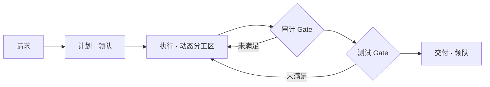

# 协作编排开发设计

本文定义“一个领队带领 N 个队员”在 Workbench 中的产品语义、领域边界、运行时契约和首期交付范围。它替代“领队拿到请求后立即自由派发”的宽泛模型，但不废弃现有 Graph、Supervisor、Entrance Policy 或 Project Role。

## 1. 结论

协作编排采用“固定流程骨架 + 领队动态分工”的混合模型：

- Graph/Flow 决定必须经历的阶段、依赖和交付门禁，即“什么必须发生”。
- 领队只在 `delegation-loop` 阶段动态拆解、分配、追问和重排，即“这一轮由谁做什么”。
- Employee 是可执行员工；任何被放进领队位置的 Employee 都临时获得系统 Skill `team-orchestration`，不需要领队资格，也不永久修改员工档案。
- Gate 按可验证的能力和运行证据选执行者，不按 `tester`、`frontend` 等角色名硬编码。
- 项目中的“xxxx 负责人”是一个真实、可执行、项目范围内的 Employee。它可以从通用 Employee Template 派生，但不是额外的系统控制层，也不要求先建 Project Role 才能存在。
- 普通讨论默认不启动协作编排。只有用户明确选择“开始协作编排”，或高级 Entrance Policy 命中 leader 路由，才创建团队 Run。

推荐的最小流程：



这不是把 Supervisor 和 Graph 强行合成同一个 Adapter。首期继续保留两个 Architecture Adapter；Supervisor Workflow 增加版本化 `flow` 配置，由 Supervisor Adapter 负责解释固定 Gate 和动态分工循环。

## 2. 分层边界

| 层 | 负责 | 不负责 |
| --- | --- | --- |
| Node / Gate | 阶段、依赖、完成条件、硬门禁 | 具体员工身份 |
| Supervisor runtime | 拆解、分工、重排、汇总 | 绕过硬 Gate、永久改员工能力 |
| Employee | 可执行身份、Provider、权限、知识和版本 | 定义全局控制流 |
| Employee Template | 可复用的员工默认配置 | 直接执行、运行时动态继承 |
| Skill | 可复用的工作方法和工具声明 | 角色身份、流程实例 |
| Project | 范围、知识、连接器和治理边界 | 代替 Employee |
| Project Role | 项目所需岗位契约和任用关系 | 表达所有项目员工的前置条件 |

Provider 调用、Skill、Employee、Architecture、Workflow 和 Run Store 仍保持独立。MCP/A2A 只作为接入边界。

## 3. 系统 Skill：`team-orchestration`

### 3.1 所有权与可见性

Skill 增加以下元数据：

```ts
type SkillOwner = "system" | "user";
type SkillInjection = "none" | "supervisor";

interface WorkbenchSkillDefinition {
  owner: SkillOwner;
  injection: SkillInjection;
}
```

- 既有 Skill 迁移为 `owner: "user"`、`injection: "none"`。
- 系统初始化时确保 `team-orchestration` 存在，`owner: "system"`、`injection: "supervisor"`。
- 用户 API 不允许创建、修订、归档或恢复系统 Skill。
- Skills 页面分成“系统能力”和“自定义能力”。系统能力可查看版本、指令、工具和使用方式，但没有管理按钮。
- 员工 Skill 绑定编辑器不显示系统 Skill；它不能被用户手工绑定。

### 3.2 运行时注入

当 Supervisor Workflow 被物化时：

1. 解析并固定当前 `team-orchestration` 版本。
2. 只把它加入 Supervisor runtime role 的 materialized Skill 列表。
3. 成员不获得该 Skill。
4. Employee 的 `skills[]` 和版本历史不发生变化。
5. Skill ID、固定版本和注入原因写入物化 Manifest 与 Run 证据。

因此“谁当领队谁具备编排能力”是位置能力，不是领队资格或员工永久能力。

## 4. 项目 Employee 与模板继承

### 4.1 领域模型

Employee 增加作用域和模板来源：

```ts
type EmployeeScope =
  | { kind: "global" }
  | { kind: "project"; projectId: string; projectVersion: number };

interface EmployeeTemplateDefinition {
  id: string;
  version: number;
  status: "active" | "archived";
  displayName: string;
  description: string;
  defaults: Omit<EmployeeCreateInput, "id" | "identity"> & {
    identity: Omit<RoleIdentityDefinition, "displayName">;
  };
}

interface EmployeeDefinition {
  scope: EmployeeScope;
  template?: { id: string; version: number };
}
```

首期只允许一层、静态、版本固定的派生：

- Template 不可执行，也不能成为 Workflow 节点或领队。
- 创建项目 Employee 时把 Template 默认值复制成一个完整 Employee 版本，并记录来源版本。
- 之后运行只读取 Employee 快照，不在运行时沿继承链求值。
- Template 升级不会暗改已有 Employee；用户通过差异预览明确生成 Employee 新版本。
- 禁止 Template 继承 Template。

### 4.2 与系统员工、Project Role 的关系

`scope` 与 `owner` 是两条轴：项目 Employee 不等于系统 Employee。现有 `identity.metadata.internalProjectId` 兼容迁移为项目作用域和内部调用边界，但不再用名字判断。

Project Role 仍用于“项目需要什么岗位”和固定任用证据；它不是创建 `xxxx负责人` 的前置条件。一个项目 Employee 可以：

- 直接接受项目内交办；
- 被绑定到一个或多个 Project Role；
- 成为项目级 Workflow 的节点、领队或成员；
- 在项目范围外被调用时由作用域校验拒绝。

首期 UI 在员工新建页提供“从模板创建”和“所属项目”，并在档案中展示固定模板版本。

## 5. 固定流程与动态分工

### 5.1 Flow 和 Gate

Supervisor Workflow 增加固定 `flow`：

```ts
type SupervisorFlowStage =
  | { id: string; kind: "supervisor"; title: string }
  | { id: string; kind: "delegation-loop"; title: string }
  | { id: string; kind: "gate"; title: string; gateId: string }
  | { id: string; kind: "delivery"; title: string };

interface SupervisorGate {
  id: string;
  requiredCapability: string;
  mode: "after-each-delegation" | "before-completion";
  required: boolean;
  instructions: string;
  fallback: "supervisor" | "block";
}
```

首期默认模板为 `plan → delegation-loop → audit → test → delivery`。Workflow 可关闭非必要 Gate，但不能在运行中静默删除硬 Gate。

### 5.2 能力解析

Employee 增加结构化 `capabilities: string[]`。能力不是角色名：

- `code.frontend`、`code.backend` 表示可承担相应实现；
- `quality.audit` 表示可审计结果；
- `quality.test` 表示可执行测试；
- `code.integration` 表示可整合多个独立代码改动。

能力来源于 Employee 的显式声明和已启用 Skill 的声明，运行时取并集并写入物化成员信息。系统不得根据 Employee ID、显示名、Project Role ID 猜测能力。

Gate 选择顺序：

1. 选择具备 `requiredCapability`、处于当前作用域且权限允许的成员；
2. 如果没有成员且 `fallback: "supervisor"`，仅当领队也具备能力且权限允许时由领队执行；
3. 否则流程进入 `blocked`，输出缺失能力、未满足 Gate 和建议的人类处理方式。

### 5.3 条件执行

- 只有产生代码改动的委派才要求代码相关 Gate。
- 只有存在两个及以上独立代码改动集时才要求 `code.integration`；一个或零个改动集直接跳过整合。
- 存在测试能力成员时优先委派测试；不存在时按 Gate fallback 决定领队自验或阻塞。
- `after-each-delegation` 在每个匹配委派完成后产生单独 Gate 工作；`before-completion` 在最终交付前聚合执行。
- 领队返回 `finish` 时，Adapter 必须检查所有 required Gate。未满足时继续进入下一轮，只有达到限制或无可执行者时才 `blocked`。

首期以显式的委派 `capabilities`、`changeSet` 和 Gate 结果作为确定性证据，不能只靠自然语言总结判定完成。

## 6. 领队决策协议

Supervisor 输出从二态扩展为：

```ts
type SupervisorDecision =
  | { action: "delegate"; summary?: string; assignments: Assignment[] }
  | { action: "satisfy-gate"; gateId: string; summary: string; evidence: JsonValue }
  | { action: "finish"; summary: string; result: JsonValue };

interface Assignment {
  roleId: string;
  task: string;
  requiredCapabilities?: string[];
  workKind?: "discussion" | "code" | "test" | "audit" | "integration" | "other";
  changeSet?: string;
  context?: JsonObject;
}
```

Adapter 确定性校验：成员存在、能力匹配、并行/总委派/轮数/时间限制、Gate 状态和完成条件。模型负责提出计划，不负责宣布自己绕过了规则。

## 7. 启动入口与后台策略

“请求分流”改为“开始一项工作”，主界面只展示三种用户意图：

1. **继续讨论**：默认项；不建工单、不建 Run、不启动领队。
2. **交给一位员工**：从当前策略已配置且可调用的 Employee、Project Employee 或 Graph 目标中选择。
3. **开始协作编排**：选择领队 Workflow，预览领队、成员、固定阶段和 Gate，确认后创建团队 Run。

`direct`、`specialist`、`leader`、Specialist Key、Source Kind 和 Signals JSON 不再出现在正常路径。它们仍保留为 Entrance Policy 的高级机制，放入折叠的“高级启动规则”，用于系统集成、调试和确定性路由。

“固定目标清册”改成可读的目标卡片；显示名称、类型、固定版本、作用域和调用边界，不把内部 key 当主标题。

协作编排详情页将 Flow 和成员关系合成一张图：固定阶段用实线，领队在 delegation-loop 中对成员的动态委派用虚线；运行态在节点上显示等待、执行、通过、阻塞和证据入口。

## 8. 权限边界

本阶段不设计新的权限产品模块。沿用现有 Employee permissions、Provider sandbox 和项目内部调用约束：

- 不在业务逻辑中加入“弹窗授权后才能委派”的临时模型；
- 系统 Skill 不扩大 Provider 或文件权限；
- Gate fallback 必须同时通过能力和权限检查；
- 缺少权限时记录为 `blocked`，并在 Run 证据中说明原因。

开发期项目角色调用按当前仓库约定使用既有授权；后续权限模块另行设计。

## 9. 迁移与兼容

- Workbench state 继续使用 schema v1 的兼容归一化；新增字段采用默认值迁移，不直接改运行数据。
- 既有 Skill 默认归属用户；初始化补齐系统 Skill。
- 既有 Employee 默认 `scope: global`、`capabilities: []`；已有内部项目元数据迁移为 project scope。
- 既有 Supervisor Workflow 自动获得默认 Flow；原先没有 Gate 的版本保持可重放，其新版本使用默认 Gate 模板。
- 既有 Entrance Policy API 和 CLI 保持兼容；UI 只改变信息架构和文案。
- 所有 Workflow、Skill、Employee、Template 和 Gate 引用均固定版本，旧 Run 继续按原物化 Manifest 重放和审计。

## 10. 首期交付和验收

### P0：系统能力与入口

- 注册并运行时注入 `team-orchestration`。
- 系统 Skill 与自定义 Skill 分组，系统 Skill 只读。
- 启动入口改为三种用户意图，高级规则折叠。
- Run 证据可看到系统 Skill 的版本和注入原因。

### P1：混合 Flow

- Supervisor Workflow 保存默认 Flow/Gate。
- Supervisor 输出和 Adapter 支持能力声明、Gate 状态和 finish 拦截。
- 编排页面同时展示固定流程和动态成员委派关系。
- 无测试成员、多代码改动、单代码改动三类路径有确定性测试。

### P2：项目员工模板

- Employee Template 注册表、版本和归档。
- 从固定模板版本创建项目 Employee。
- 项目作用域校验、模板来源展示和显式升级。

验收必须覆盖：类型与 Schema 校验、旧 state 迁移、系统 Skill 管理拒绝、仅领队注入、Gate 能力匹配、未满足 Gate 阻止完成、项目 Employee 越界拒绝、模板版本固定、API/CLI 兼容、前端关键交互和本地 mock workflow。最终运行 `npm run check`。
